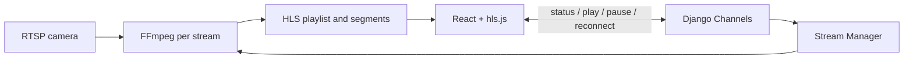

# RTSP Stream Viewer

A React and Django dashboard for monitoring RTSP cameras. It converts each camera feed to low-latency HLS with FFmpeg, plays it in the browser with hls.js, and uses Django Channels WebSockets for lifecycle events and controls.

## Architecture



HLS is the media transport because browsers cannot decode RTSP. WebSockets are meaningful control-plane infrastructure: consumers receive FFmpeg state changes and issue validated stream commands. FFmpeg is run with an argument list, never a shell command.

## Quick start (Docker)

```bash
cp .env.example .env
docker compose up --build
```

Open `http://localhost:5173`. The backend is `http://localhost:8000/api/health/`.

## Local development

Install FFmpeg first, then run the backend and frontend separately:

```bash
cd backend
python -m venv .venv
.venv\Scripts\activate  # Windows; use source .venv/bin/activate on macOS/Linux
pip install -r requirements.txt
python manage.py migrate
daphne -b 0.0.0.0 -p 8000 config.asgi:application
```

```bash
cd frontend
npm install
npm run dev
```

FFmpeg: Windows `winget install Gyan.FFmpeg`; macOS `brew install ffmpeg`; Debian/Ubuntu `sudo apt install ffmpeg`.

## Tests and quality checks

```bash
cd backend && pytest && ruff check .
cd frontend && npm run build
```

## Security and limits

- Only `rtsp` and `rtsps` URLs are accepted; newlines and malformed values are rejected.
- Credentials are retained only server-side and never returned in API responses, UI, or errors.
- Configure `RTSP_ALLOWED_HOSTS` in public deployments. Private, loopback and link-local IP literals are refused unless explicitly allowlisted. DNS names should also be allowlisted in production to mitigate SSRF and DNS rebinding.
- `MAX_ACTIVE_STREAMS` limits FFmpeg processes (default 4). Restarts are bounded to four with exponential delays.
- Set exact `CORS_ALLOWED_ORIGINS`, `ALLOWED_HOSTS`, a strong `DJANGO_SECRET_KEY`, HTTPS API URL, and WSS URL for deployment.

## Deployment

Deploy the static Vite build to GitHub Pages or another static host. Deploy the Docker backend to an ASGI-capable host that permits long-running FFmpeg processes and Redis. Set `VITE_API_URL` and `VITE_WS_URL` at frontend build time; use `https://` and `wss://` in production. HLS storage is local to one backend instance, so use sticky routing/shared storage or a single worker for this implementation.

RTSP URLs are intentionally configurable and no public test cameras are bundled. See [API documentation](docs/api.md) and [architecture notes](docs/architecture.md).
